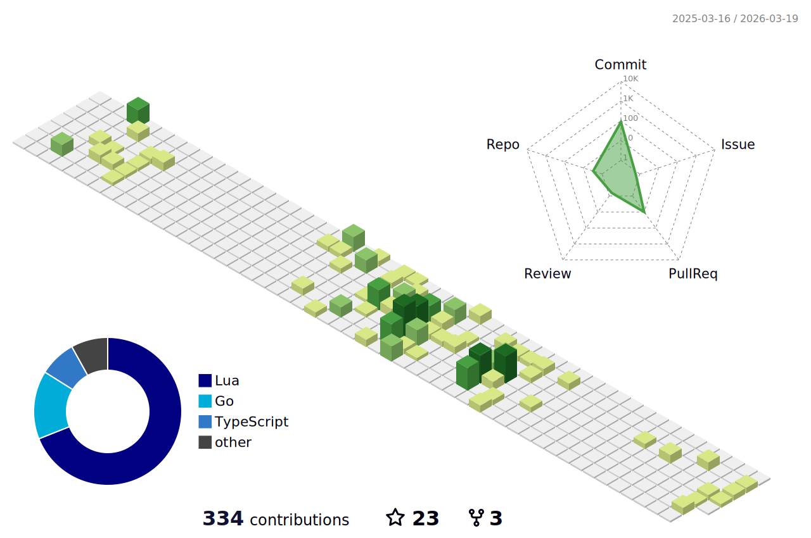

<!-- Heading -->
<h3 align="center"> Hello! I'm Alun</h3>

I work in TS/JS and Rust. I'm also good with HTML, CSS and testing. Currently _really_ enjoying writing my code in Neovim and trying to figure out how to configure it as my perfect editor, whilst picking up some Lua along the way.

